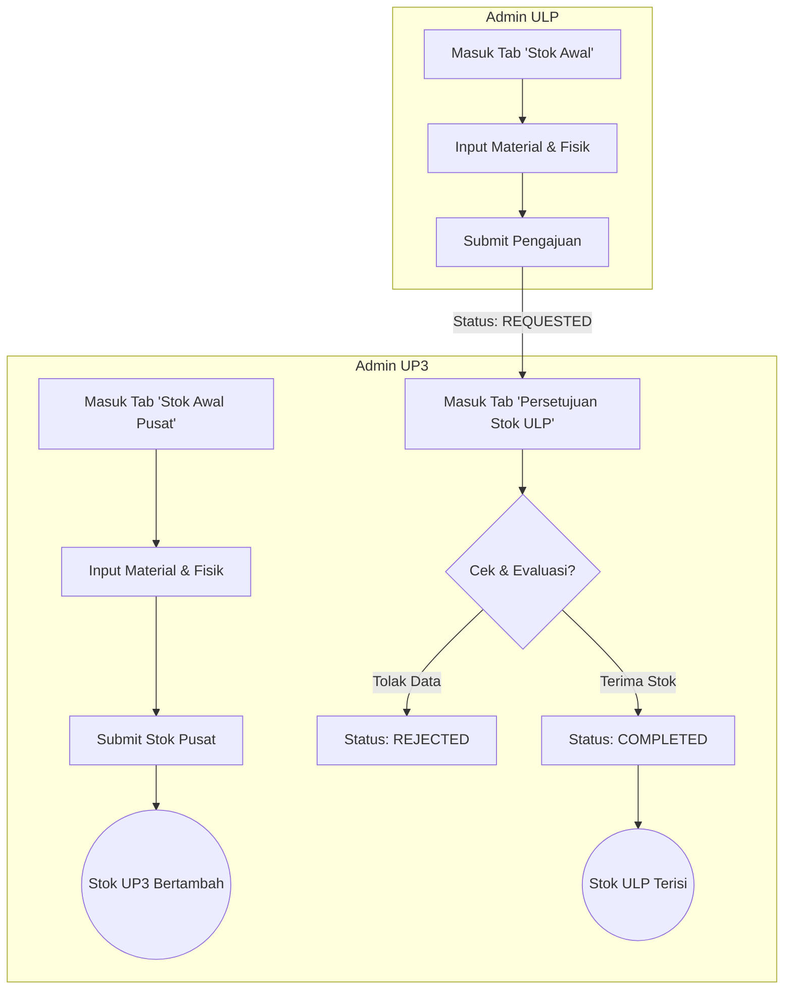
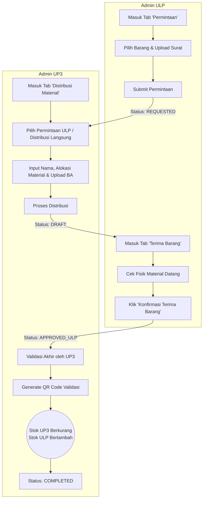
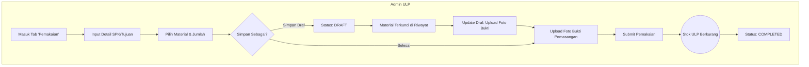

# Flowchart Sistem SIMOGU PLN (UP3 & ULP)

Berikut adalah visualisasi alur kerja (flowchart) dari sistem inventaris material berdasarkan logika aplikasi saat ini. Alur kerja dibagi menjadi 3 proses utama: **Pengisian Stok Awal**, **Distribusi Material**, dan **Pemakaian Lapangan**.

## 1. Alur Pengisian Stok Awal (Initial Stock)

---

## 2. Alur Permintaan & Distribusi Material

---

## 3. Alur Pemakaian Lapangan (Usage)

## Keterangan Status Transaksi

- **`REQUESTED`**: ULP telah mengajukan permintaan (baik permintaan barang maupun input stok awal). Menunggu respon dari UP3.
- **`DRAFT`**:
  - (Pada Distribusi): UP3 sudah mengirim barang secara sistem dan fisik, menunggu ULP mengonfirmasi penerimaan.
  - (Pada Pemakaian): ULP mencatat pemakaian lapangan tapi belum melampirkan foto dokumentasi akhir.
- **`APPROVED_ULP`**: ULP sudah menerima fisik barang distribusi dari UP3. UP3 perlu melakukan finalisasi sistem.
- **`COMPLETED`**: Transaksi sukses, mutasi stok (tambah/kurang) telah terjadi dan diakumulasikan ke sistem inventaris utama.
- **`REJECTED`**: UP3 menolak pengajuan atau permintaan dari ULP. Tidak ada perubahan stok yang terjadi.
